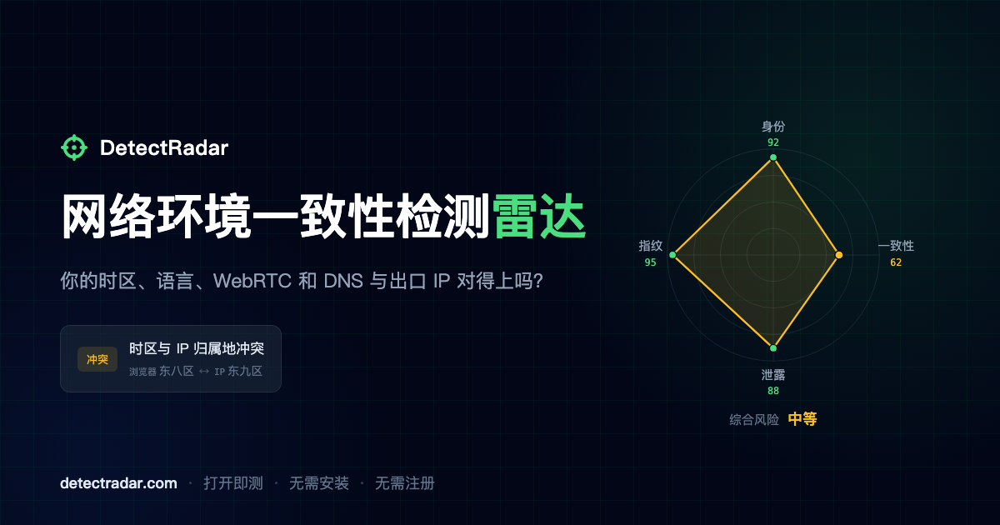

# DetectRadar

**网络环境一致性检测工具。** 核对当前出口 IP 与浏览器的时区、语言和环境特征，同时检查 WebRTC、DNS 和 IPv6 泄露，生成诊断报告和雷达图。

[在线体验](https://detectradar.com/) · [隐私政策](https://detectradar.com/privacy)



## 它能做什么

- 核对浏览器时区、系统语言与当前出口 IP 所在地区是否一致。
- 检查 WebRTC、DNS 和 IPv6 是否暴露了与当前出口不同的网络信息。
- 展示当前出口 IP 的归属地、ASN、运营商、网络类型和信誉信息。
- 检查 Canvas、Audio、WebGL 等浏览器环境特征及自动化标记。
- 将检测结果整理成问题清单、雷达图和分享卡片。

打开网页后会自动开始检测，无需安装或注册。分享图由浏览器本地生成，并自动脱敏 IP；页面中的完整报告仍会显示当前出口 IP，便于核对结果。

## 它怎样工作

浏览器负责采集时区、语言、环境特征和网络泄露信号，后端根据本次连接的出口 IP 补充网络信息，再统一完成一致性判断和评分。

DNS 检测依赖 DetectRadar 的权威 DNS 服务，因此会在主报告之后异步返回。如果浏览器或网络拦截了检测请求，对应项目会显示“未检测”，不会被当成正常结果。

## 能力边界

- DetectRadar 检查的是可观测到的网络和浏览器环境，不根据单个 IP 猜测连接用途。
- “未发现异常”只代表本次检测没有命中已知问题，不等于任何场景下都没有风险。
- IP 信誉、开放端口等部分信息来自第三方数据源，可能存在延迟或误差。
- WebRTC、DNS、IPv6 等信号可能因浏览器设置、扩展或网络策略而无法获取；报告会明确标出这类情况。

## 数据与隐私

检测所需的浏览器环境信息会提交给后端用于比对和评分，Canvas、Audio、WebGL 等内容以哈希形式提交。扫描判定快照用于质量改进，具体留存方式见[隐私政策](https://detectradar.com/privacy)。

用户主动生成的分享图通过浏览器 Canvas 在本地绘制，不上传服务器，图中的 IP 会自动脱敏。

## 项目结构

| 目录 | 说明 |
| --- | --- |
| `client/` | Astro + Svelte 5 前端，负责采集信息和展示报告 |
| `server/` | Go + Fiber 后端，负责出口 IP 信息查询、一致性判断、泄露复核和评分 |

机房识别所需的云厂商 IP 段由独立项目 [cloud-ip-crawler](https://github.com/harrisonwang/cloud-ip-crawler) 生成。

## 快速开始

后端运行前需要准备 `server/data/` 下的地理与 ASN 数据库，以及机房识别数据库。

```bash
# 后端
cd server
cp configs/config.yaml.example configs/config.yaml
make run

# 前端（另开一个终端）
cd client
npm install
npm run dev
```

前端默认调用 `http://127.0.0.1:8080`，可以通过 `PUBLIC_API_BASE` 修改。
